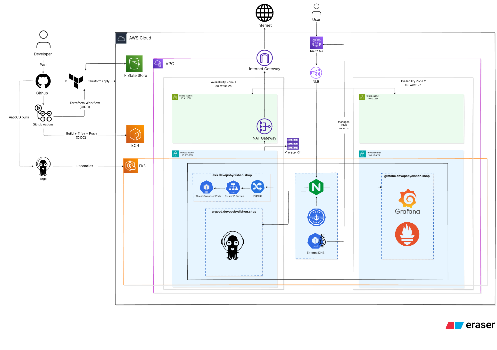

# AWS EKS GitOps Platform for Threat Composer

---


---

A containerised deployment of AWS Threat Composer on Amazon EKS using Terraform for infrastructure, GitHub Actions for CI, ArgoCD for GitOps deployment, and Prometheus + Grafana for monitoring.

The project focuses on deploying and operating the application on AWS using Kubernetes, infrastructure as code, automated delivery, HTTPS, DNS automation, workload identity, and observability.

> The application code is based on the open-source AWS Threat Composer project. This repository focuses on the infrastructure, deployment, automation, and operational aspects of running the application on EKS.

---

## Tech Stack

- **Cloud:** AWS
- **Infrastructure:** Terraform, Amazon S3 remote state
- **Compute:** Amazon EKS with managed node groups
- **Networking:** VPC, public/private subnets across two Availability Zones, NAT Gateway, Route 53
- **Containers:** Docker, Amazon ECR
- **Orchestration:** Kubernetes
- **Ingress:** NGINX Ingress Controller
- **DNS:** ExternalDNS
- **TLS:** cert-manager + Let's Encrypt
- **CI/CD:** GitHub Actions
- **GitOps:** ArgoCD
- **Authentication:** GitHub OIDC
- **Workload Identity:** IRSA
- **Observability:** Prometheus + Grafana
- **Image Scanning:** Trivy

---

## Architecture



Application traffic follows this path:

```text
User
   |
   v
Route 53
   |
   v
AWS Network Load Balancer
   |
   v
NGINX Ingress Controller
   |
   v
Kubernetes Ingress
   |
   v
ClusterIP Service
   |
   v
Threat Composer Pod
```

The EKS worker nodes run in private subnets across two Availability Zones.

Terraform provisions the AWS infrastructure, GitHub Actions builds and pushes container images to ECR, and ArgoCD reconciles the Kubernetes manifests stored in Git with the live EKS cluster.

ExternalDNS manages Route 53 records for the public ingresses, while cert-manager uses Let's Encrypt HTTP-01 challenges to issue and renew their TLS certificates.

---

## CI/CD and GitOps

Application changes follow this delivery flow:

```text
Application change
       |
       v
GitHub Actions
       |
       +----> Build Docker image
       |
       +----> Trivy scan
       |
       +----> Push SHA-tagged image to Amazon ECR
       |
       +----> Update deployment.yaml in Git
                          |
                          v
                       ArgoCD
                          |
                          v
                       Amazon EKS
```

The GitHub Actions workflow:

1. authenticates to AWS using OIDC
2. builds the Docker image
3. scans the image with Trivy
4. tags the image using the Git commit SHA
5. pushes the image to Amazon ECR
6. updates the Kubernetes Deployment manifest
7. commits the new image tag back to Git

ArgoCD then detects the Git change and reconciles the desired state into EKS.

Infrastructure changes use a separate, manually triggered Terraform workflow. After an operator types `yes` to confirm deployment, GitHub Actions assumes the Terraform IAM role through OIDC and runs Terraform 1.9.8, TFLint, init, validate, plan, and apply. Application image delivery remains separate in `.github/workflows/docker.yaml`.

---

## Observability

The project uses `kube-prometheus-stack` for cluster monitoring.

Prometheus collects cluster metrics and Grafana provides visibility into:

- CPU utilisation
- memory utilisation
- resource requests and limits
- namespace usage
- network traffic


The intended public endpoint is `https://grafana.devopsbydishen.shop`, routed through NGINX Ingress to `monitoring-grafana:80`. ExternalDNS manages its Route 53 record and cert-manager requests its TLS certificate from Let's Encrypt.

---

## GitOps Verification

ArgoCD successfully reconciled the application and reported it as:

- **Healthy**
- **Synced**


The ArgoCD resource tree shows the Deployment, ReplicaSet, Pod, Service, Ingress, and TLS Certificate managed through GitOps.

The intended public endpoint is `https://argocd.devopsbydishen.shop`. NGINX connects to the `argocd-server:443` backend over HTTPS.

---

## Troubleshooting

### ImagePullBackOff

During deployment, the Threat Composer Pod entered an `ImagePullBackOff` state.

The Kubernetes Deployment referenced:

```text
threat-composer-eks:latest
```

but the ECR repository contained images tagged with Git commit SHAs.

I diagnosed the issue by checking the Pod status and comparing the image configured in the Deployment with the tags available in ECR.

The root cause was an image tag mismatch.

During recovery, the Deployment was temporarily aligned with an image tag that existed in ECR so the workload could start successfully. The final application pipeline uses commit-SHA image tags for traceability.

After recovery:

- the Pod returned to `Running`
- ArgoCD reported `Healthy`
- ArgoCD reported `Synced`
- the application returned HTTP `200 OK` over HTTPS

---

## How to Reproduce

### Prerequisites

Install:

- AWS CLI
- Terraform
- Docker
- kubectl
- Helm
- Git

You will also need:

- an AWS account
- a Route 53 hosted zone
- the required GitHub OIDC IAM roles

> The GitHub OIDC IAM roles are bootstrap dependencies and must exist before running the GitHub Actions workflows.

### 1. Clone the repository

```bash
git clone <repository-url>
cd eks-prod-project
```

### 2. Initialise Terraform

```bash
cd terraform
terraform init
```

### 3. Review the infrastructure plan

```bash
terraform plan
```

### 4. Provision the infrastructure

Manually run the GitHub Actions workflow and enter `yes` when prompted:

```text
Terraform EKS Infrastructure
```

The workflow authenticates to AWS using OIDC, validates the Terraform configuration, creates a plan, and applies it. This is an operator-confirmed deployment; it is not PR-gated.

### 5. Deploy the Kubernetes platform

Run the GitHub Actions workflow:

```text
Deploy EKS Platform
```

This installs:

- NGINX Ingress Controller
- cert-manager
- ExternalDNS
- ArgoCD
- kube-prometheus-stack

### 6. Deploy the application

Run the application pipeline or push an application change to `main`.

### 7. Verify the deployment

```bash
kubectl get nodes
kubectl get pods
kubectl get ingress
```

Verify the three intended HTTPS endpoints:

- Threat Composer: `https://eks.devopsbydishen.shop`
- Grafana: `https://grafana.devopsbydishen.shop`
- ArgoCD: `https://argocd.devopsbydishen.shop`

ArgoCD should report the application as:

```text
Healthy
Synced
```

### 8. Destroy the environment

Run the GitHub Actions workflow:

```text
Destroy EKS Platform
```

The teardown workflow removes the Kubernetes platform components before running:

```bash
terraform destroy
```

The teardown was tested successfully:

```text
Destroy complete! Resources: 56 destroyed.
```

---

## Decisions and Trade-offs

### Why EKS?

EKS was chosen to build practical experience with Kubernetes orchestration, managed node groups, ingress, GitOps, workload identity, and cluster observability.

A separate ECS-based project uses the same application to compare Kubernetes orchestration with a more AWS-native container platform.

### Why ArgoCD?

GitHub Actions handles the CI process and updates the desired deployment state in Git.

ArgoCD handles deployment into Kubernetes by continuously reconciling Git with the live cluster.

This keeps Git as the source of truth rather than allowing the CI pipeline to deploy directly to the cluster.

### Why NGINX Ingress?

NGINX provides the Kubernetes ingress layer for the application.

Its `LoadBalancer` Service provisions an AWS Network Load Balancer, while Kubernetes Ingress rules handle routing to the application inside the cluster.

### Why HTTP-01?

cert-manager uses an HTTP-01 ACME challenge through NGINX to prove ownership of the application hostname to Let's Encrypt.

This avoids giving cert-manager Route 53 permissions. ExternalDNS manages DNS records, while cert-manager completes HTTP-01 challenges through NGINX for the public hostnames.

### Why GitHub OIDC?

GitHub Actions uses OIDC to assume AWS IAM roles and receive temporary credentials.

This avoids storing long-lived AWS access keys in GitHub.

### Why IRSA?

IRSA gives ExternalDNS AWS permissions through its Kubernetes ServiceAccount rather than through the EKS worker node role.

This allows Route 53 permissions to be scoped specifically to the workload that requires them.

### Why SHA Image Tags?

Container images are tagged with Git commit SHAs to provide traceability between the source code, ECR image, and Kubernetes deployment.

### Why One NAT Gateway?

A single NAT Gateway was used to reduce the cost of the portfolio environment.

A production environment requiring stronger Availability Zone independence would typically use one NAT Gateway per Availability Zone.

---

## Project Status

The original Threat Composer deployment, GitOps reconciliation, monitoring stack, HTTPS application endpoint, and teardown have prior test evidence in this repository. This closeout revision adds the OIDC Terraform workflow and public Grafana and ArgoCD ingresses, but a fresh end-to-end apply, platform deployment, endpoint check, GitOps reconciliation, and teardown still need to be run after the changes are committed.
